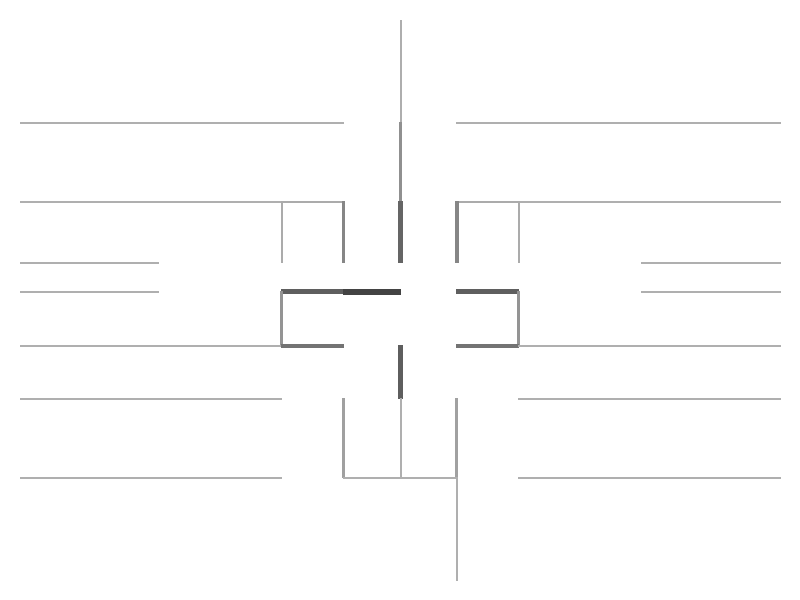
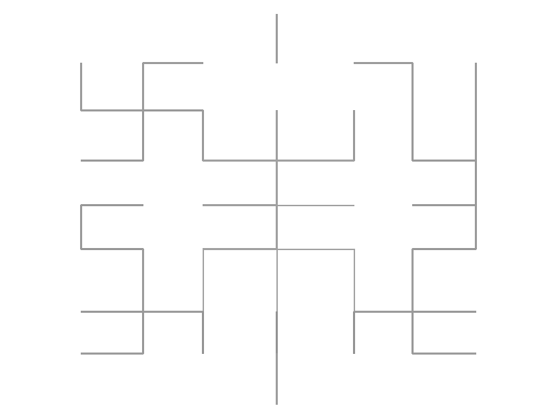
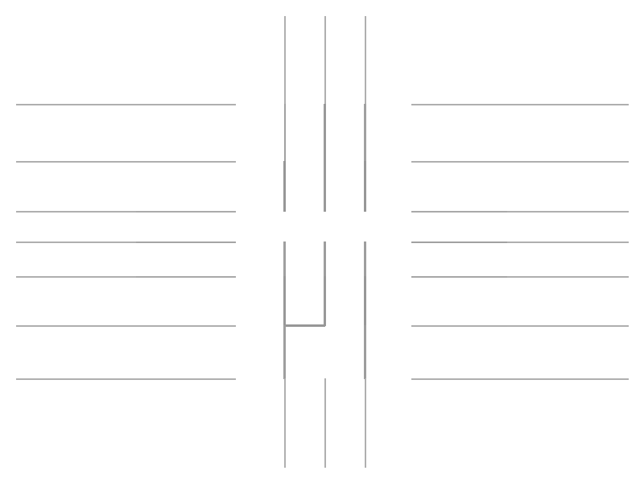
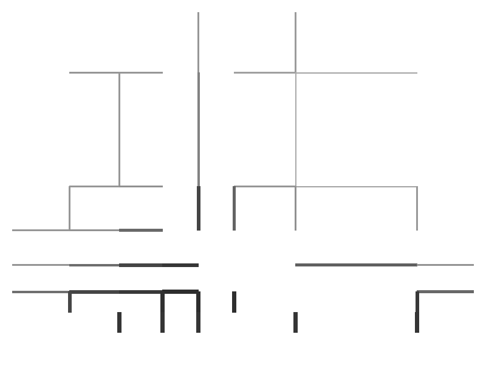
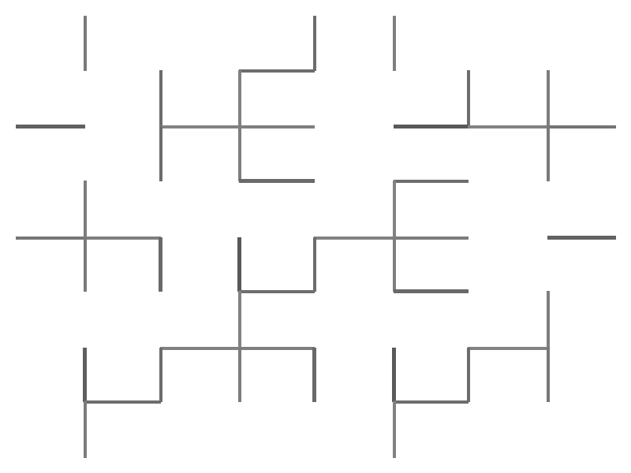

# AI Unicursal Maze Generator

[](https://pypi.org/project/maze-artisan/)
[](https://pypi.org/project/maze-artisan/)
[](https://opensource.org/licenses/MIT)


画像をアップロードして、一筆書き迷路風の SVG/PNG を生成するローカル Web アプリです。入力画像の輪郭・シルエットに沿った一筆パスから迷路を生成します。

- **バックエンド**: FastAPI  
- **フロントエンド**: Streamlit（ローカル利用前提）

---

## Installation (maze-artisan CLI)

```bash
pip install maze-artisan
```

Or install from source:

```bash
git clone https://github.com/maze-artisan/ai-unicursal-maze
cd ai-unicursal-maze
pip install -e ".[dev]"
```

## Quick Start

```python
from PIL import Image
from backend.core.density.dm8 import generate_dm8_maze, DM8Config

image = Image.open("photo.jpg")

# Generate with DM-8 multiscale (recommended)
result = generate_dm8_maze(image, DM8Config(difficulty="hard", passage_ratio=0.10))
with open("maze.png", "wb") as f:
    f.write(result.png_bytes)
print(f"SSIM: {result.ssim_score:.4f}, Grid: {result.grid_rows}×{result.grid_cols}")
print(f"Scale weights: {result.scale_weights_used}")

# Or use DM-6 directly
from backend.core.density.dm6 import generate_dm6_maze, DM6Config
result = generate_dm6_maze(image, DM6Config(difficulty="hard"))
with open("maze.png", "wb") as f:
    f.write(result.png_bytes)
print(f"SSIM: {result.ssim_score:.4f}, Grid: {result.grid_rows}×{result.grid_cols}")
```

## CLI Usage

### optimize — Bayesian parameter search

```bash
# Search optimal parameters for a portrait photo (100 trials)
maze-artisan optimize --image photo.jpg --trials 100 --category portrait --output preset.json

# Dry-run: validate inputs only
maze-artisan optimize --image photo.jpg --category logo --dry-run
```

### generate — Difficulty-controlled maze

```bash
# Generate a hard maze
maze-artisan generate --image photo.jpg --difficulty hard --output maze.png

# Generate using difficulty score (0.0=easy … 1.0=extreme)
maze-artisan generate --image photo.jpg --difficulty-score 0.8

# Generate with category preset
maze-artisan generate --image photo.jpg --preset portrait --difficulty medium

# Dry-run: validate without generating
maze-artisan generate --image photo.jpg --difficulty extreme --dry-run
```

### Difficulty levels

| Level   | Grid size | Extra removal rate | Notes           |
|---------|-----------|-------------------|-----------------|
| easy    | 6×6       | 40%               | Many loops      |
| medium  | 10×10     | 15%               | Balanced        |
| hard    | 14×14     | 5%                | Few loops       |
| extreme | 16×16     | 0%                | Pure spanning tree |

### Category presets (for optimize)

| Category  | Focus                         |
|-----------|-------------------------------|
| portrait  | High tonal levels, fine grid  |
| landscape | Medium grid, broad structure  |
| logo      | High contrast, low tonal      |
| anime     | Edge emphasis, outline        |

---

## maze-artisan との対応

本リポジトリは **maze-artisan** の実装リポジトリです。

| 項目 | 内容 |
|------|------|
| 要件・タスク | maze-artisan（Obsidian）の `01_Requirements.md`, `03_Tasks.md`, `02_Design.md` を参照 |
| 参照先例 | `C:\Users\owner\Documents\Obsidian Vault\10_Projects\maze-artisan`（ローカル Obsidian Vault 内） |
| 現状 | **V1.1** 完了（Stage A〜D パイプライン、解数・難易度返却）。**V2** 中期タスク（T-5〜T-7）進行中。**Phase DM-3 達成 ✅**（387 テスト PASS・Masterpiece 品質評価実装済み） |
| Gap 分析 | 本リポジトリ `docs/GAP_ANALYSIS.md` に要件との差分・次タスクを記載 |

---

## セットアップ

### 環境

- **Python**: 3.10 以降を推奨
- **依存**: プロジェクトルートで以下を実行

```bash
pip install -r requirements.txt
```

既存の仮想環境がある場合は、先に有効化してから実行してください。

### オプション依存

- **mediapipe**（`requirements.txt` に含む）: 顔ランドマーク・顔マスク用。未導入でも動作しますが、顔らしさ強調が弱まります。
- 導入例: `pip install mediapipe==0.10.14`

---

## 起動手順

### 方法 1: 手動で 2 プロセス起動（推奨）

1. **FastAPI バックエンド**（プロジェクトルートで実行）

   ```bash
   uvicorn backend.app:app --reload
   ```

   `http://localhost:8000` で API が待ち受けます。

2. **Streamlit フロントエンド**（別ターミナルで、同じくプロジェクトルートから）

   ```bash
   streamlit run frontend/ui.py
   ```

   ブラウザが開き、AI 一筆迷路ジェネレーターの UI が表示されます。

### 方法 2: 二段階で起動（いちばん確実・推奨）

1. **`run_backend_only.bat`** をダブルクリック  
   → 「Uvicorn running on http://127.0.0.1:8001」と出るまで待つ。**このウィンドウは閉じない。**

2. **別のウィンドウで `run_frontend_only.bat`** をダブルクリック  
   → ブラウザで http://localhost:8501 が開く。

（バックエンド・フロントとも **port 8001** を使用するため、8000 が他で使われていてもそのまま使えます。）

### 方法 3: 一括起動（Windows）

プロジェクトルートで `run_app.bat` を実行すると、バックエンドとフロントエンドを別ウィンドウでまとめて起動します（`--reload` は付けていません。`.venv` があれば自動で有効化）。

```batch
run_app.bat
```

### 接続エラーが出る場合

「接続できませんでした」「Max retries exceeded」と出る場合は、**バックエンドが起動していない**可能性が高いです。  
先に **`run_backend_only.bat`** を実行し、「Uvicorn running on http://127.0.0.1:8001」と表示されたら、その窓を閉じずに **`run_frontend_only.bat`** でフロントを開いてください。  
（通常はバックエンド・フロントとも port **8001** を使用します。8000 が他で使われていても問題ありません。）

### その他のスクリプト

- **RUN.bat** / **RUN_EXPERIMENTS.bat**: バッチ実験用（`scripts/` 内の p11 系スクリプト実行）。Web アプリの起動には使いません。

---

## 使い方

1. Streamlit の UI で画像ファイル（PNG/JPEG）をアップロードする。
2. サイドバーで **出力幅・高さ**、**線の太さ**、**線画モード**、**迷路の粗さ**（スパー長・ノイズ除去閾値）、**maze_weight**（顔らしさ↔迷路性）などを調整する（任意）。
3. 処理ステップのボタン（①線画 → ②一筆書き → ③迷路 → ④ダミー迷路）のいずれかを押す。
4. 生成結果が表示され、SVG/PNG をダウンロードできる。

画像サイズは最大 10MB まで（超過時は HTTP 413）。

---

## Masterpiece 機能（Phase DM-3 達成 ✅）

高品質な密度迷路を生成する「Masterpiece」モードを実装。画像誘導ルーティング・可変壁厚・ループ密度制御の **3本柱**を同時有効化することで、視覚的に豊かな迷路を生成します（387 テスト全 PASS）。

### 黄金設定（Golden Setting）

| パラメータ | 値 | 説明 |
|---|---|---|
| `grid_size` | **8** | 小グリッドで高 SSIM を実現 |
| `thickness_range` | **1.5** | 可変壁厚（暗部: 太く / 明部: 細く） |
| `extra_removal_rate` | **0.5** | ループ密度制御（暗部にループ追加） |
| `use_image_guided` | **True** | 画像誘導ルーティング（暗→明の最短経路） |

### Gallery（SSIM ベンチマーク, DM-7 masterpiece preset）

| カテゴリ | 生成結果 | SSIM |
|----------|---------|------|
| Logo |  | 0.5781 |
| Anime |  | 0.5389 |
| Portrait |  | 0.5375 |
| Landscape |  | 0.4930 |
| Photo |  | 0.0689 |

> `passage_ratio=0.10`（v0.6.0）での実測値。スコアが高いほど元画像の視覚的再現度が高い。

- DM-7 実装前（`passage_ratio=0.50` 固定）: gradient SSIM = **0.4453**（旧天井）
- `passage_ratio=0.10` 採用で gradient SSIM = **0.6149**（+38% 改善）
- 旧ベースライン（`grid_size=30`）: gradient SSIM = 0.4476 [fair]

---

## DM-8: マルチスケール密度マップ（v1.0.0 新機能）

DM-8 は L1/L2/L3 の 3 スケールを加重合成したピラミッド型密度マップを使用し、グローバル輝度構造とローカル細部の両方を迷路構造に反映します。

```python
from PIL import Image
from backend.core.density.dm8 import generate_dm8_maze, DM8Config

image = Image.open("photo.jpg")

# デフォルト: scale_weights=(0.2, 0.3, 0.5), coarse_size=4, medium_size=8
result = generate_dm8_maze(image, DM8Config(
    difficulty="hard",
    passage_ratio=0.10,          # 通路幅制御（0.10が最高SSIM）
    scale_weights=(0.2, 0.3, 0.5),  # L1/L2/L3 の重み
    coarse_size=4,               # L1 グリッドサイズ（4×4）
    medium_size=8,               # L2 グリッドサイズ（8×8）
))
print(f"SSIM: {result.ssim_score:.4f}")
print(f"Scale weights used: {result.scale_weights_used}")
```

### スケール構成

| スケール | サイズ | デフォルト重み | 役割 |
|---------|-------|--------------|------|
| L1 (coarse) | 4×4 | 0.2 | グローバル輝度分布 |
| L2 (medium) | 8×8 | 0.3 | 中間ディテール（輪郭・テキスト塊） |
| L3 (fine)   | フル | 0.5 | 局所セル単位輝度 |

> **ヒント**: `cell_size_px≥16` の大セル設定でマルチスケール効果が最大化されます。

---

## CI（GitHub Actions）

`push` / `pull_request` で `.github/workflows/ci.yml` が実行されます。

- **内容**: 依存インストールと `pytest tests/` のみ。外部APIキー・シークレットは一切使用しません（**費用は発生しません**）。
- 将来有料APIを組み込む場合も、CI にはシークレットを渡さない設計にしています。

---

## 今後の拡張

- **V2**: スケルトン安定化（T-5）、オイラー路エントリ設計（T-6）、UI オプション整理（T-7）。
- **顔らしさ向上**: 一筆パス美観（T-11）、顔・髪再現性強化（T-12）。要件・タスクは maze-artisan の 03_Tasks を参照。
- 現状の差分と次タスクは `docs/GAP_ANALYSIS.md` を参照。

---

## 顔らしさ向上 TODO（メモ）

- 顔マスク/ランドマークを try/except でフォールバックしているため、失敗時は顔形状の反映が弱い。
- Canny 依存の線画は髪・背景ノイズの影響を受けやすい。顔帯域の前処理・しきい値制御の強化が有効。
- グラフ重み（ランドマーク優先）とパススコアの改善、スケルトン品質維持、回帰テストの追加が今後の対応候補。
- 詳細は maze-artisan の要件と `docs/GAP_ANALYSIS.md` を参照。
